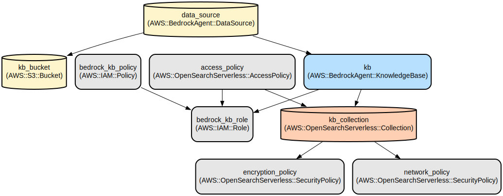

# AWS Bedrock Knowledge Base Infrastructure with Vector Search and OpenSearch Serverless

This project provides an automated infrastructure setup for deploying an AWS Bedrock Knowledge Base with vector search capabilities using OpenSearch Serverless. It enables organizations to create and manage AI-powered knowledge bases that can efficiently store, search, and retrieve information using vector embeddings.

The infrastructure is defined using Terraform and creates a complete serverless environment including S3 storage, OpenSearch Serverless collection, and Bedrock Agent knowledge base with vector search capabilities. It leverages Amazon's Titan embedding model for text vectorization and implements secure IAM roles and policies for resource access. The setup supports fixed-size chunking for document ingestion and configurable vector dimensions for optimal search performance.

## Repository Structure
```
.
├── knowledge_base_index_details.txt   # OpenSearch vector index configuration
├── locals.tf                         # Local variable definitions for knowledge base and S3 configuration
├── main.tf                          # Core infrastructure resource definitions
├── outputs.tf                       # Output variable definitions for resource references
├── provider.tf                      # AWS provider configuration
└── variables.tf                     # Input variable definitions for deployment customization
```

## Usage Instructions
### Prerequisites
- Terraform >= 1.0
- AWS CLI configured with appropriate credentials
- AWS account with permissions to create:
  - IAM roles and policies
  - S3 buckets
  - OpenSearch Serverless collections
  - Bedrock Agent resources

### Installation

1. Clone the repository and navigate to the project directory:
```bash
git clone <repository-url>
cd <project-directory>
```

2. Initialize Terraform:
```bash
terraform init
```

3. Review and modify variables in `variables.tf` if needed:
```hcl
region      = "us-west-2"    # Default AWS region
environment = "dev"          # Deployment environment
sid         = "kb"           # Service identifier
```

4. Deploy the infrastructure:
```bash
terraform plan    # Review the changes
terraform apply   # Note: This will initially fail
```

5. After the initial failure, create the required OpenSearch index:
```bash
# Get the OpenSearch collection endpoint from AWS Console
# Use the configuration from knowledge_base_index_details.txt to create the index
# You can use the AWS Console to create the index
```

6. Complete the deployment:
```bash
terraform apply   # Run again after index creation
aws bedrockagent start-ingestion-job --knowledge-base-id $(terraform output -raw knowledge_base_id) --data-source-id data_source  # Sync the data source
# Wait for ingestion job to complete
aws bedrockagent list-ingestion-jobs --knowledge-base-id $(terraform output -raw knowledge_base_id)  # Check ingestion status
```

### Quick Start

1. After deployment, retrieve the created resource names:
```bash
terraform output
```

2. Upload documents to the created S3 bucket:
```bash
aws s3 cp your-document.pdf s3://$(terraform output -raw s3_bucket_name)/
```

3. The Bedrock Agent will automatically process and index the uploaded documents using the configured vector search settings.

### More Detailed Examples

1. Configuring Vector Search Parameters:
```hcl
# In locals.tf
locals {
  aoss = {
    vector_dimension = 1024
    vector_index     = "bedrock-knowledge-base-default-index"
    vector_field     = "bedrock-knowledge-base-default-vector"
  }
}
```

2. Customizing Document Chunking:
```hcl
vector_ingestion_configuration {
  chunking_configuration {
    chunking_strategy = "FIXED_SIZE"
    fixed_size_chunking_configuration {
      max_tokens = 2048
      overlap_percentage = 10
    }
  }
}
```

### Troubleshooting

1. OpenSearch Collection Access Issues
- Problem: Unable to access OpenSearch collection
- Solution: Verify network policy configuration:
```bash
aws opensearch list-security-policies --type network
```

2. Bedrock Agent Permission Issues
- Problem: Bedrock Agent cannot access S3 or OpenSearch
- Solution: Check IAM role permissions:
```bash
aws iam get-role --role-name <sid>-bedrock-kb-role
aws iam get-role-policy --role-name <sid>-bedrock-kb-role --policy-name <sid>-bedrock-kb-policy
```

## Data Flow

The knowledge base infrastructure processes and stores data through a vector-based search system using OpenSearch Serverless. Documents are uploaded to S3, processed by Bedrock Agent, and stored as vector embeddings for efficient retrieval.

```ascii
Upload → S3 Bucket → Bedrock Agent → Vector Processing → OpenSearch Storage
         ↑                                                      ↓
         └──────────────────── Vector Search ─────────────────-┘
```

Key component interactions:
1. Documents are uploaded to the S3 bucket
2. Bedrock Agent processes documents using the Titan embedding model
3. Documents are chunked according to fixed-size configuration
4. Vector embeddings are generated with 1024 dimensions
5. OpenSearch Serverless stores vectors with FAISS engine
6. Vector search enables efficient similarity-based retrieval
7. IAM roles and policies control access between components

## Infrastructure



### S3
- `aws_s3_bucket.kb_bucket`: Storage bucket for knowledge base documents

### IAM
- `aws_iam_role.bedrock_kb_role`: IAM role for Bedrock service
- `aws_iam_role_policy.bedrock_kb_policy`: Access policy for Bedrock operations

### OpenSearch Serverless
- `aws_opensearchserverless_collection.kb_collection`: Vector search collection
- `aws_opensearchserverless_security_policy.encryption_policy`: Encryption configuration
- `aws_opensearchserverless_security_policy.network_policy`: Network access rules
- `aws_opensearchserverless_access_policy.access_policy`: Data access controls

### Bedrock Agent
- `aws_bedrockagent_knowledge_base.kb`: Knowledge base configuration
- `aws_bedrockagent_data_source.data_source`: S3 data source configuration